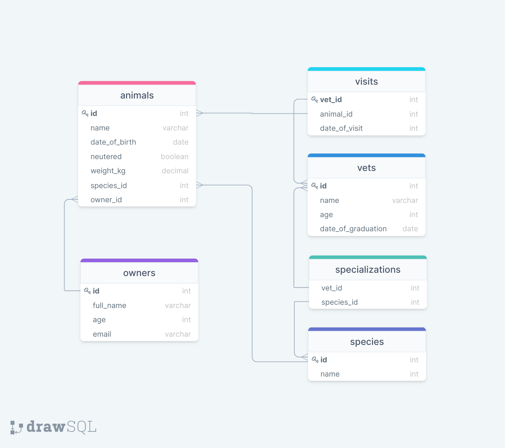

# Vet clinic

> In this project, I will use a relational database to create the initial data structure for a vet clinic. I will create a table to store animals' information, insert some data into it, and query it.

## Getting Started

This repository includes files with plain SQL that can be used to recreate a database:

- Use [schema.sql](./schema.sql) to create all tables.
- Use [data.sql](./data.sql) to populate tables with sample data.
- Check [queries.sql](./queries.sql) for examples of queries that can be run on a newly created database. **Important note: this file might include queries that make changes in the database (e.g., remove records). Use them responsibly!**

## Database Diagram

## Authors

👤 **Roberto A. Baños Alvarez**

- GitHub: [@rbanos-mv](https://github.com/rbanos-mv)
- Twitter: [@RobertoBanosMV](https://twitter.com/RobertoBanosMV)
- LinkedIn: [Roberto A Baños Alvarez](https://linkedin.com/in/roberto-a-baños-alvarez-500766234)

## 🤝 Contributing

Contributions, issues, and feature requests are welcome!

Feel free to check the [issues page](../../issues/).

## Show your support

Give a ⭐️ if you like this project!

## Acknowledgments

- [Microverse](https://www.microverse.org/) for the motivation.
- Database diagram created in collaboration with [Santiago Cárdenas](https://github.com/Santiago220991)

## 📝 License

This project is [MIT](./MIT.md) licensed.
